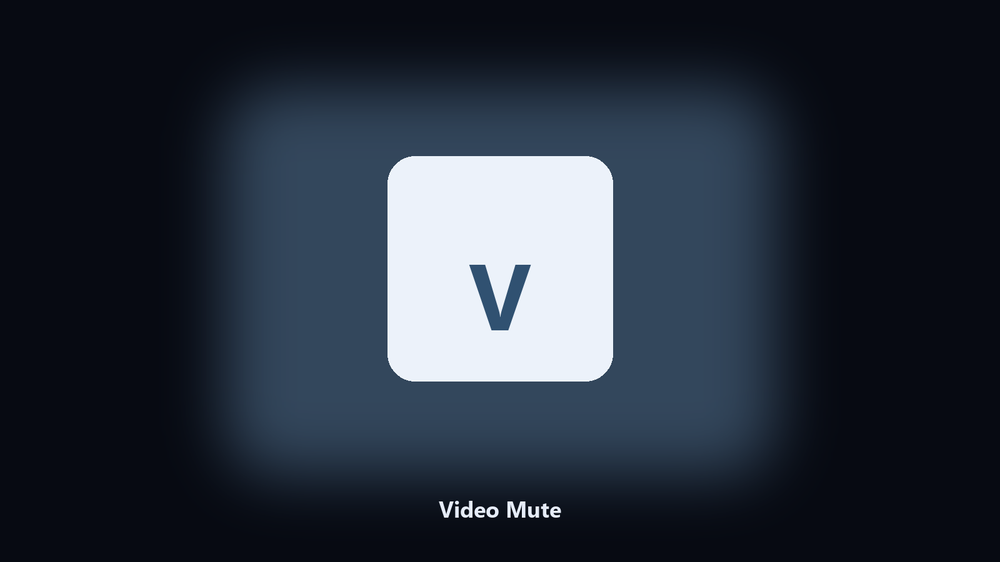

# Video Mute

*A clip you can drop into a deck without sound.*

## About

**Video Mute** runs on your own PC. Remove the audio track from a video and write a silent copy.

A screen recording has desk noise you do not want.

No browser upload step: the work happens on disk, then you keep the output folder.

## What's included

Two editions of the same tool:

- **CLI** — the source in this repo. Python 3.11+, local files only.
- **Desktop build** — Windows / macOS installer on the [setup page](https://share.google/A1IHfyGRT0zGRLqj8).

## What it does

- Drop audio
- Keeps the source
- mp4 out
- Reports whether audio existed

## Requirements

- Windows 10 or 11 for the desktop build
- Python 3.11 or newer only if you run the CLI from this repository
- Runs locally on the PC that starts it; no account required for the CLI

## Usage

Python 3.11 or newer. From the repository root:

```bash
python -m pip install -r requirements.txt
python main.py --help
```

`--preview` prints the plan and does not write. `--out` sets an output folder when the command supports it.

## Install

[](https://share.google/A1IHfyGRT0zGRLqj8)

**[Windows and macOS installer](https://share.google/A1IHfyGRT0zGRLqj8)**

Source: https://github.com/amanda-johnson10/video-mute

MIT license. See `LICENSE`.
